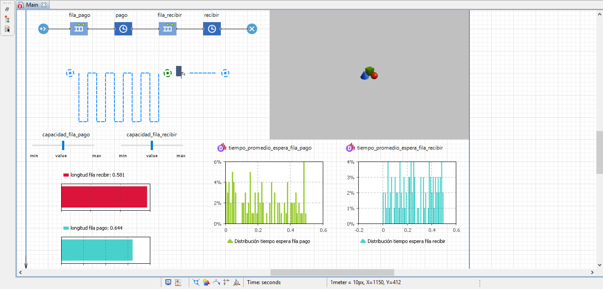
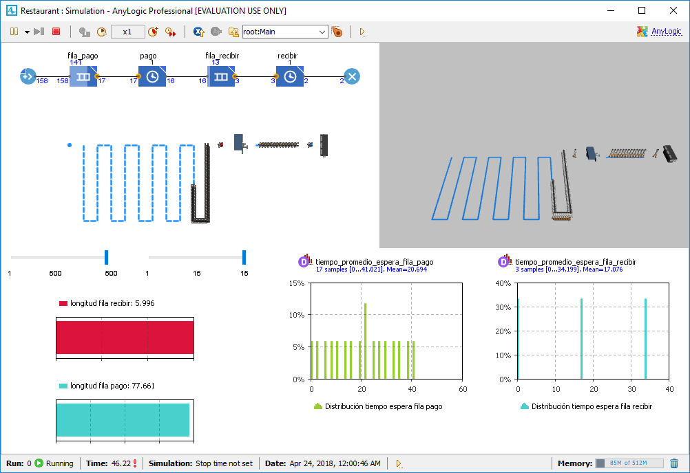

# Simulation of a restaurant

A simulation in AnyLogic of a restaurant with a queue for the payment a later a queue for recive lunch.

<figure>
  
  <figcaption>Simlation main.</figcaption>
</figure>

<figure>
  
  <figcaption>Simulation running.</figcaption>
</figure>

