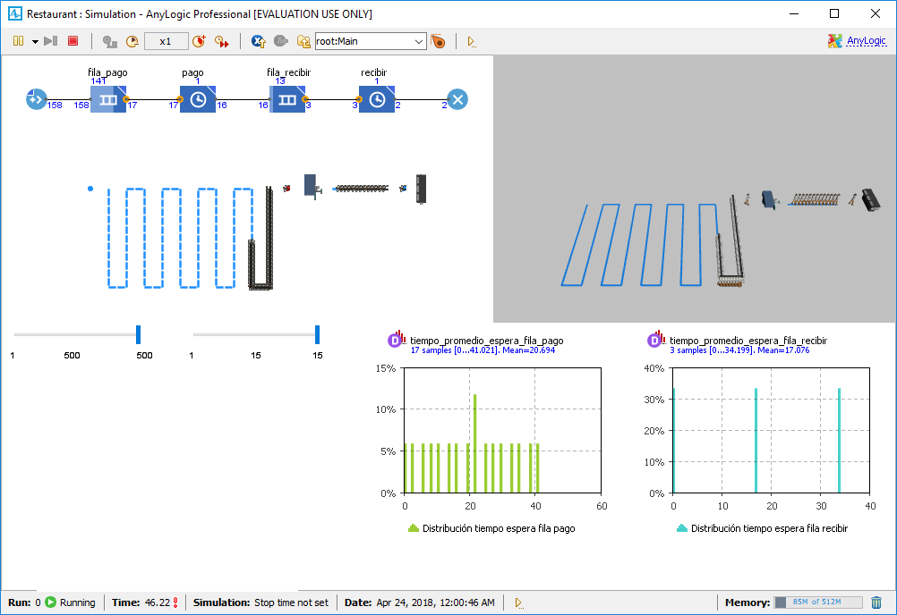
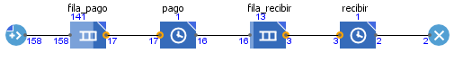
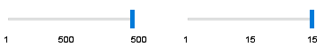
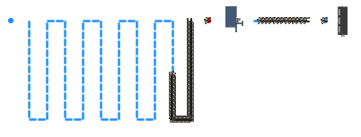
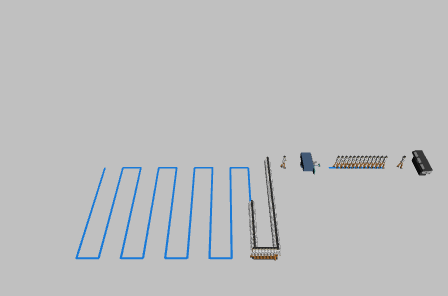
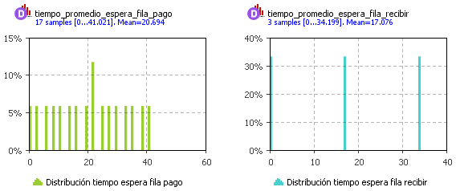

# Simulation of a restaurant

A simulation in AnyLogic of a restaurant with a queue for the payment a later a queue for recive lunch.

Simulation running:

 

Flowchart:

 

Queues capacity:

 

2D animation:

 

3D animation:

 

Distribution histogram of average queue time:

 
